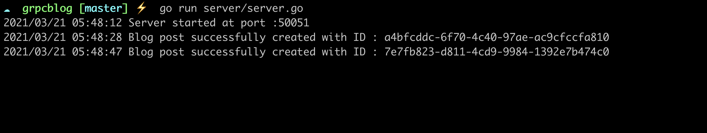

# grpcblog

Implementation of a simple RPC service using Golang. The RPC service can create and save blog posts.
 - Client sends a request to the server to create a blog post with a given title and content.
 - The server saves the blog posts created to a temporary in-memory storage.

[Here is the link to my article which explains the implementation of the code]()

Directory structure
```bash
grpcblog
├── Makefile
├── blog
│   ├── blog.pb.go
│   ├── blog.proto
│   └── blog_grpc.pb.go
├── client
│   └── client.go
├── go.mod
├── go.sum
├── server
│   └── server.go
├── storage
    └── storage.go
```
To clean up the generated proto files run:
```bash
make clean
```
To compile the proto file run:
```bash
make gen
```
This generates two files:
```bash
blog/blog_grpc.pb.go
blog/blog.pb.go
```
***blog_grpc.pb.go*** contains interfaces with no implementation. 
***blog.pb.go*** contains protocol buffer code - responsible for binary serialization of data when it is transported between server and client.


Run ***server*** and ***client*** code in two separate terminal windows:



